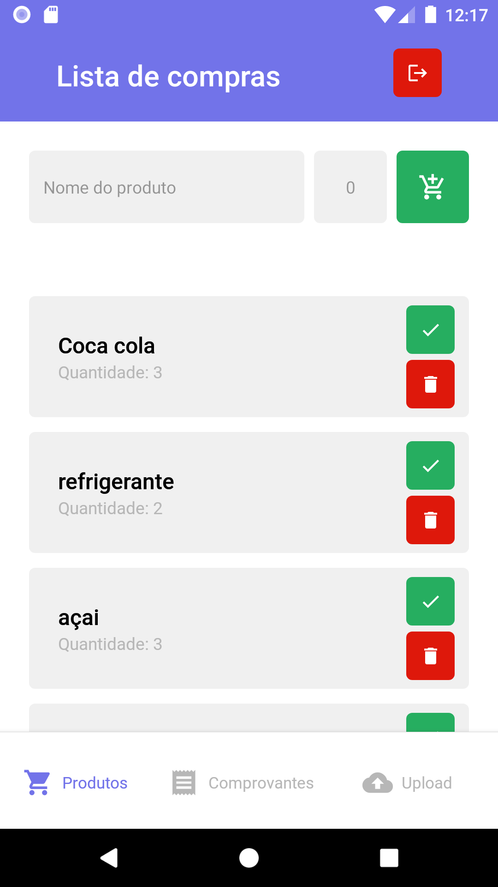
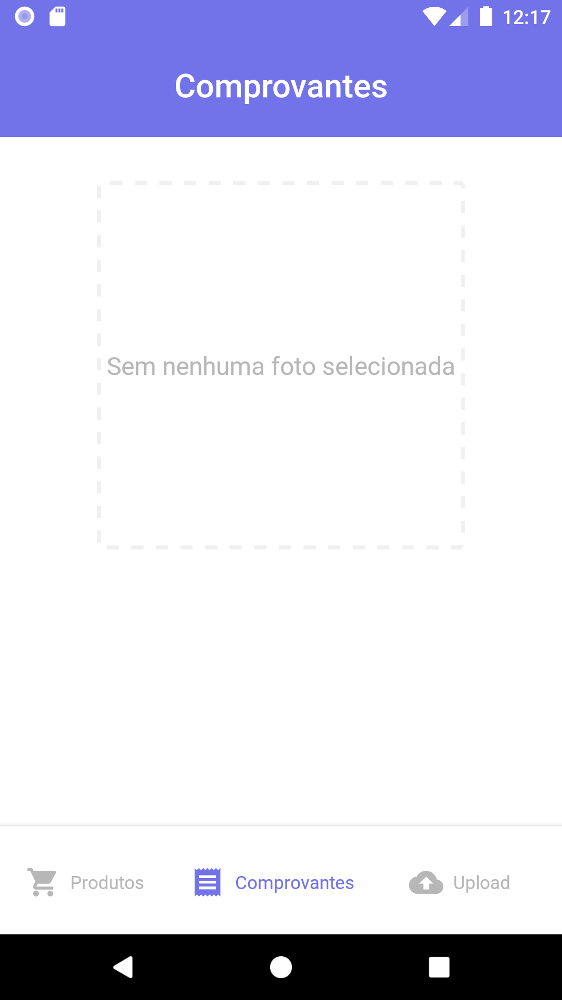
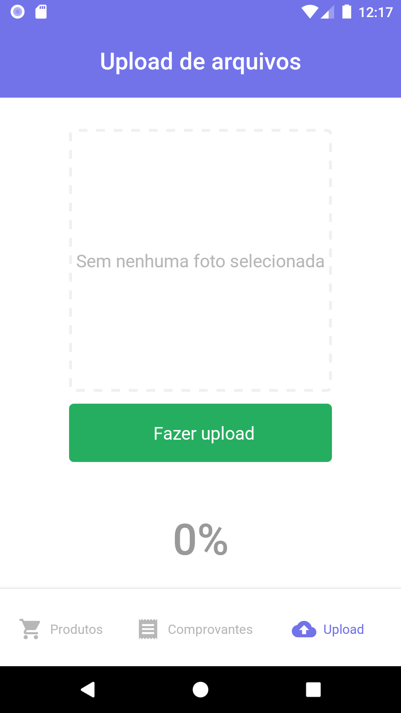

# MyShopping

<h1 align="center">
    MyShopping
</h1>
 

Projeto criado para estudar os fundamentos do Firebase

<h4 align="center">
  MyShopping
</h4>

Telas do App

    
    
    
    

## :rocket: Tecnologias

Esse projeto foi desenvolvido com as seguintes tecnologias:

- [React Native](https://facebook.github.io/react-native/)
- [Firebase](https://firebase.google.com/)

## 💻 Projeto

Entre as funcionalidades do Firebase este projeto contem:
<ul>
<li>Login</li>
<li>OnSnapshot</li>
<li>Criação de documentos</li>
<li>Upload de imagens</li>
<li>Registro de usuário</li>
<li>Reset de senha</li>
</ul>

